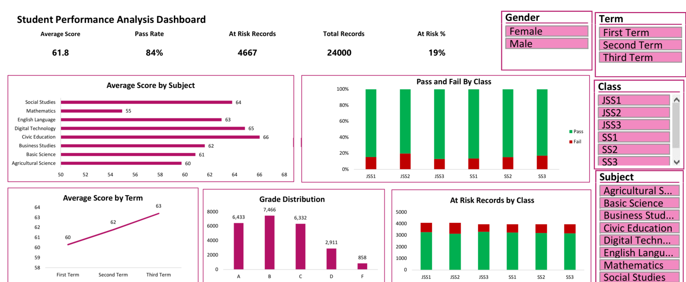

# Student Performance Dashboard (Excel)

An interactive Excel dashboard that analyses student results across classes, subjects and terms, built from a synthetic dataset of 1,000 students and 24,000 records. The project shows the full analytics workflow in Excel: data cleaning, formulas, pivot tables, slicers and dashboard design.

## Dashboard Preview



*The finished dashboard with five KPI cards, five charts and four slicers (Class, Term, Subject and Gender). Download the Excel file to use the slicers interactively.*

## Table of Contents

1. Project Overview
2. Business Problem and Questions
3. Dataset
4. Tools and Skills Used
5. Data Cleaning
6. Formulas and Business Logic
7. Pivot Tables
8. Dashboard Features
9. Key Insights
10. Recommendations
11. Limitations
12. Repository Structure
13. How to Use This Project
14. Future Improvements
15. About the Author

## 1. Project Overview

Schools collect large amounts of result data every term, but it often stays in long spreadsheets that are hard to read. This project turns that raw data into a single dashboard that helps a teacher, head of department or principal see how students are performing and who needs support.

The dashboard answers practical questions in seconds, and four slicers let the viewer filter everything by class, term, subject and gender with one click.

## 2. Business Problem and Questions

The school leadership wants to understand academic performance and act early on problems. This project answers the following questions:

1. What is the overall average score and pass rate?
2. Which subjects are strongest and weakest?
3. Which classes have the highest and lowest pass rates?
4. Are scores improving from First Term to Third Term?
5. How are grades distributed across all students?
6. How many records are flagged At Risk, and in which classes?
7. Do results differ by gender?

## 3. Dataset

The data is fully **synthetic**. It was generated for learning and portfolio purposes, and it does not describe any real student or school.

**Size:** 1,000 students, 8 subjects, 3 terms, which gives 24,000 records after cleaning (24,060 before removing duplicates).

**Coverage:** Classes JSS1 to SS3, arms A and B, session 2025/2026.

**Subjects:** Mathematics, English Language, Basic Science, Digital Technology, Social Studies, Civic Education, Business Studies and Agricultural Science.

**Columns:**

1. Student_ID: unique student code
2. Student_Name: full name
3. Gender: Male or Female
4. Class: JSS1 to SS3
5. Arm: A or B
6. Session: academic session
7. Term: First, Second or Third Term
8. Subject: one of eight subjects
9. CA1: first continuous assessment, out of 20
10. CA2: second continuous assessment, out of 20
11. Exam: exam score, out of 60
12. Attendance_Pct: attendance for the term, in percent

**Calculated columns added in this project:** Total, Grade, Result and At Risk.

The raw dataset deliberately included data quality problems (inconsistent gender entries, extra spaces in names, duplicate rows and missing values) to practise real cleaning.

## 4. Tools and Skills Used

1. Microsoft Excel
2. Excel Tables
3. Find and Replace, Remove Duplicates and Paste Special
4. Formulas: IF, OR, AVERAGEIFS, TRIM, LEFT
5. Pivot Tables and Pivot Charts
6. Slicers with Report Connections
7. GETPIVOTDATA based KPI cards
8. Dashboard layout and chart formatting

## 5. Data Cleaning

The cleaning followed a clear step by step process.

1. **Standardised Gender.** Entries such as M, F, male, FEMALE and values with extra spaces were converted to Male and Female using a formula that reads the first letter after trimming spaces.
2. **Cleaned names.** Extra spaces and inconsistent capital letters were removed from Student_Name.
3. **Removed duplicates.** About 60 repeated rows were removed using Student_ID, Term and Subject as the key. The row count fell from 24,060 to 24,000.
4. **Handled missing attendance.** Missing values had turned into 0, which wrongly flagged students as At Risk. Each zero was replaced with the same student's attendance for the same term, using AVERAGEIFS that ignores zeros.
5. **Handled missing exam scores.** Blank exam values were reviewed and handled so that Total scores were not understated.
6. **Checked the result.** Gender shows only Male and Female, no zeros remain in Attendance_Pct, and the record count is 24,000.

## 6. Formulas and Business Logic

**Total score**

```
=CA1 + CA2 + Exam
```

**Grade** (nested IF on Total)

```
=IF(Total>=70,"A",IF(Total>=60,"B",IF(Total>=50,"C",IF(Total>=45,"D","F"))))
```

Grade scale used: A is 70 and above, B is 60 to 69, C is 50 to 59, D is 45 to 49, and F is below 45.

**Result** (pass mark is 50)

```
=IF(Total>=50,"Pass","Fail")
```

**At Risk flag** (a record is At Risk if the score is below 50 or attendance is below 75 percent)

```
=IF(OR(Total<50,Attendance_Pct<75),"At Risk","OK")
```

**Attendance repair**

```
=IF(Attendance=0,AVERAGEIFS(Attendance,StudentID,[@StudentID],Term,[@Term],Attendance,">0"),Attendance)
```

## 7. Pivot Tables

Five pivot tables feed the dashboard, one question per pivot.

1. **Average score by subject.** Subject in Rows, average of Total in Values.
2. **Pass and Fail rate by class.** Class in Rows, Result in Columns and Values, shown as a percent of row total.
3. **Average score by term.** Term in Rows, average of Total in Values.
4. **Grade distribution.** Grade in Rows, count of Grade in Values.
5. **At Risk records by class.** Class in Rows, At Risk in Columns and Values.

## 8. Dashboard Features

1. **Five KPI cards:** Average Score, Pass Rate, At Risk Records, Total Records and At Risk percent. They link to the pivots, so they update with every slicer click.
2. **Four slicers:** Class, Term, Subject and Gender, all connected to every pivot through Report Connections.
3. **Five charts:** a bar chart for subject averages, a 100 percent stacked column for pass and fail by class, a line chart for the term trend, a column chart for grades, and a stacked column for At Risk records.
4. **Clean design:** clear titles, data labels, a colour code of green for Pass and red for Fail, and an axis that starts at 50 so differences between subjects are easy to see.

## 9. Key Insights

1. The overall **average score is 61.8** and the **pass rate is about 84 percent**.
2. **Mathematics is the weakest subject** with an average of about 55, while **Civic Education is the strongest** at about 66.
3. **Scores improve every term**, from about 60 in First Term to about 63 in Third Term.
4. **JSS2 has the lowest pass rate** at about 80 percent, and **JSS3 has the highest** at about 87 percent.
5. About **19 percent of records (4,667) are flagged At Risk**.
6. Grade B is the most common grade (7,466 records), followed by A (6,433) and C (6,332). Only 858 records fall in grade F.

## 10. Recommendations

1. Give extra support to **Mathematics**, for example remedial classes and extra practice material, since it is the weakest subject in every class.
2. Investigate **JSS2**, which has the lowest pass rate, to find out whether the cause is teaching, attendance or assessment.
3. Track **attendance** closely, because it is one of the two triggers for the At Risk flag.
4. Use the **At Risk list** each term so teachers can contact parents early instead of waiting for the final result.
5. Share the strong practice in **Civic Education** and **Digital Technology** with other departments.

## 11. Limitations

1. The data is synthetic, so the insights show the method and not real school performance.
2. At Risk counts **records** (one student in one subject in one term), not distinct students.
3. The pass mark of 50 and the attendance cut off of 75 percent are assumptions and can be changed.
4. Excel dashboards cannot be viewed live on GitHub, so this repository includes screenshots and the downloadable workbook.

## 12. Repository Structure

```
Student_Performance_Dashboard_Excel/
    README.md
    Student_Performance_Dashboard.xlsx
    student_performance_raw.xlsx
    images/
        dashboard.png
```

## 13. How to Use This Project

1. Download **Student_Performance_Dashboard.xlsx** from this repository.
2. Open it in Excel 2016 or later (slicers need Excel 2010 or later).
3. Go to the **Dashboard** sheet and click the slicers to filter by class, term, subject or gender.
4. To clear a filter, click the funnel icon with the red X in the top corner of a slicer.
5. Open the **Pivot_Table** sheet to see the tables behind the charts.
6. To practise the cleaning yourself, start from **student_performance_raw.xlsx**.

## 14. Future Improvements

1. Add a count of distinct At Risk students instead of At Risk records.
2. Rebuild the cleaning in Power Query so it refreshes automatically with new data.
3. Add a student level view with a top ten and bottom ten list.
4. Recreate the dashboard in Power BI with DAX measures.
5. Add attendance against score analysis to test how strongly the two are linked.

## 15. About the Author

**Omobolaji Kehinde Zachariah (Bolaji)** is a data analyst and BI specialist, and a teacher turned analyst. He breaks down complex problems into simple, step by step explanations and builds projects in public.

He also runs **The Analytics Ladder**, a free WhatsApp community for aspiring data analysts in Nigeria.

1. Portfolio: [komobolaji20-droid.github.io](https://komobolaji20-droid.github.io)
2. GitHub: [github.com/komobolaji20-droid](https://github.com/komobolaji20-droid)
3. Email: [komobolaji20@gmail.com](mailto:komobolaji20@gmail.com)

If you find this project useful, please give the repository a star and share your feedback.
